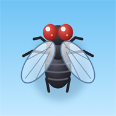

<p align="center">
  
</p>

# Fly Catcher · صيد الذباب

A gentle fly-catching game for young kids. Tap a fly and a net swoops down to catch it. Built as a single-page web app with no dependencies, it can be installed on phones and tablets and plays offline.

**Play:** [tinyurl.com/fly-catch](https://tinyurl.com/fly-catch)

## Modes

- **🪰 Let's play!** Catch the flies across five levels that get gradually faster. Made for ages 2–3.
- **🐝 Watch the bees:** catch the flies but leave the bees alone while they sip from their flowers.
- **🏆 Challenge:** points, a timer, streak multipliers, combo catches and a saved best score.

## Features

- Arabic and English, picked from the browser language, with a toggle on the start screen
- Installable as an app (PWA) and fully playable offline
- Sounds generated in the browser, with stereo buzzing that follows each insect
- Works with touch and mouse, and pauses automatically when the app goes to the background
- Light and dark themes that follow the device setting

## Run locally

The game loads its language files with `fetch`, so it must be served over HTTP rather than opened as a file:

```sh
python -m http.server 8000
```

Then open <http://localhost:8000>. Any static server works, including VS Code Live Server.

## Project structure

```
index.html            page markup (no text, only translation keys)
css/style.css         styles
js/game.js            game logic
lang/<code>.json      one translation file per language
sw.js                 service worker for offline play
manifest.webmanifest  install settings
icons/                app icons (icon.svg is the source)
```

## Adding a language

1. Copy `lang/en.json` to `lang/<code>.json` (for example `lang/fr.json`) and translate the values. Set `langName` to the language's own name and `dir` to `ltr` or `rtl`.
2. Add the code to `LANGUAGES` at the top of the Languages section in `js/game.js`.
3. Add `"./lang/<code>.json"` to the `CORE` list in `sw.js` so it works offline.

Any key missing from a new file falls back to Arabic. `{n}` in a string is replaced with a number, so a translation can place it wherever its grammar needs.

## Releasing an update

Push to `main` and GitHub Pages redeploys in about a minute. Bump `VERSION` in both `js/game.js` and `sw.js` on every release; otherwise installed copies keep serving the old cached version.

## License

[MIT](LICENSE)
