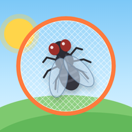

<p align="center">
  
</p>

# Fly Catcher · صيد الذباب

A gentle game for young kids with flies, butterflies and ants: tap a fly and a net swoops down to catch it, take each butterfly to the flower of its colour, or drop food and watch an ant carry it home. Built as a single-page web app with no dependencies, it can be installed on phones and tablets and plays offline.

**Play:** [mohammad-diab.github.io/fly-catch-app](https://mohammad-diab.github.io/fly-catch-app/) · short link: [tinyurl.com/fly-catch](https://tinyurl.com/fly-catch)

## Modes

- **🪰 Let's play!** Catch the flies across five levels that get gradually faster. Made for ages 2–3.
- **🐝 Watch the bees:** catch the flies but leave the bees alone while they sip from their flowers.
- **🦋 Butterfly garden:** every butterfly flies to the flower of its own colour; nothing to get wrong.
- **🌸 Watch the colours:** only the butterflies that match the flower may be caught. Every colour wears a real butterfly's markings, so colour-blind kids can match by shape.
- **🐜 Feed the ants:** tap the ground to drop food; an ant comes out, takes a bite and carries the rest home.
- **🏆 Challenge:** points, a timer, streak multipliers, combo catches and a saved best score.

## Features

- Arabic and English, picked from the browser language, with a toggle on the start screen
- Installable as an app (PWA) and fully playable offline from the first launch; the font ships with the game, so nothing loads from other websites
- Collects nothing: no accounts, ads, tracking or analytics; only the language, best score and last "What's new" seen stay on the device ([privacy page](privacy.html))
- A "What's new" screen with one moving picture per version, so even a 3-year-old can see what changed
- Grown-up buttons (language, What's new, Challenge, Install, Update) need a press-and-hold, so a toddler can't set them off
- Sounds generated in the browser, with stereo buzzing that follows each insect
- Each mode has its own sky and ground, so a child can tell the games apart at a glance
- Works with touch and mouse, and pauses automatically when the app goes to the background
- Light and dark themes that follow the device setting

The full list of features per mode, and the rules behind them, is in [docs/FEATURES.md](docs/FEATURES.md). What changed in each version is in [CHANGELOG.md](CHANGELOG.md).

## Run locally

The game loads its language files with `fetch`, so it must be served over HTTP rather than opened as a file:

```sh
python -m http.server 8000
```

Then open <http://localhost:8000>. Any static server works, including VS Code Live Server. On localhost the offline service worker is switched off, so a normal reload always shows your latest changes.

The game is written in TypeScript in `src/` and built into `js/game.js` with esbuild. The built file is committed, so GitHub Pages serves it with no build step. With Node.js (version in `.node-version`):

```sh
npm install
npm run watch       # rebuilds js/game.js on every save
npm run check       # type check, build, then the release checks
```

## Project structure

```
index.html            page markup (no text, only translation keys)
css/style.css         styles
src/                  game source in TypeScript
js/game.js            built from src/ by npm run build (committed, never edit by hand)
lang/<code>.json      one translation file per language
sw.js                 service worker for offline play
manifest.webmanifest  install settings
icons/                app icons (icon.svg is the source)
privacy.html          privacy page for parents and app stores (linked from the menu)
screenshots/          install-window screenshots listed in the manifest (wide and narrow), captured from the game
icons/share.jpg       1200×630 preview card for links shared on WhatsApp and social apps
fonts/                Baloo Bhaijaan 2, shipped with the game (SIL Open Font License, see fonts/OFL.txt)
tools/check.py        release checks, run before every push
docs/FEATURES.md      feature checklist and design rules for every mode
CHANGELOG.md          what changed in each version
```

## Adding a language

1. Copy `lang/en.json` to `lang/<code>.json` (for example `lang/fr.json`) and translate the values. Set `langName` to the language's own name and `dir` to `ltr` or `rtl`.
2. Add the code to `LANGUAGES` at the top of the Languages section in `src/main.ts`, then run `npm run build`.
3. Add `"./lang/<code>.json"` to the `CORE` list in `sw.js` so it works offline.

Any key missing from a new file falls back to Arabic. `{n}` in a string is replaced with a number, so a translation can place it wherever its grammar needs.

## Releasing an update

Run `npm run check` first (or `python tools/check.py` on its own): it checks that every text exists in both languages, the version numbers and changelog agree, every offline and manifest file exists, nothing loads from other websites, the privacy page still lists everything the game saves, the JavaScript has no syntax errors and `js/game.js` is the build of the current `src/` (when Node.js is available, directly or through fnm). Then push to `main` and GitHub Pages redeploys in about a minute. Bump `VERSION` in both `src/main.ts` and `sw.js` on every release, otherwise installed copies keep serving the old cached version, and add an entry to `CHANGELOG.md`. Installed apps pick up the new version the next time they come back on screen and show an "Update the game" pill on the menu.

## License

[MIT](LICENSE)
